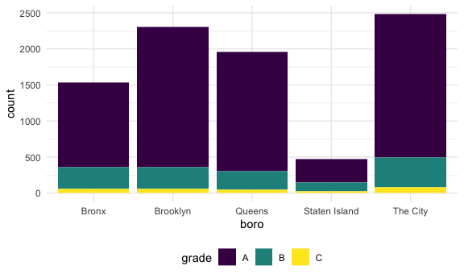
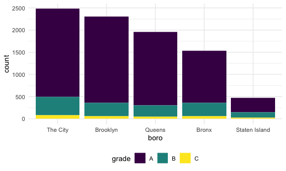
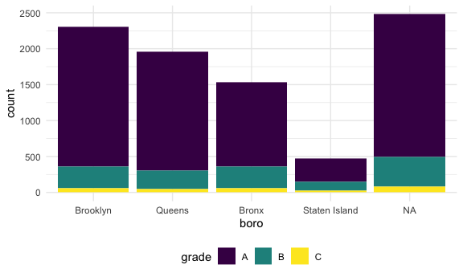

strings and factors
================
Shihui Peng
2023-10-22

# strings

## detect

### str_detect()

``` r
string_vec = c('my', 'name', 'is', 'shihui')

str_detect(string_vec, 'shihui')
```

    ## [1] FALSE FALSE FALSE  TRUE

``` r
str_detect(string_vec, 'm')
```

    ## [1]  TRUE  TRUE FALSE FALSE

``` r
str_detect(string_vec, 'S')
```

    ## [1] FALSE FALSE FALSE FALSE

- to identify the elements of this string that corresponds to my name –
  detect a particular pattern with .
  - **`str_detect()`**: given a string or a vector of character obs,
    detect the presence or absence of a pattern in a string.
    - don’t need the whole string to match w the pattern (the ‘e’
      example).
    - uppercase and lowercase are different values when working w
      strings. (the ‘S’ example).

### start/end with

``` r
string_vec_2 = c(
  "i think we all rule for participating",
  "i think i have been caught",
  "i think this will be quite fun actually",
  "it will be fun, i think"
  )

str_detect(string_vec_2, '^i think')
```

    ## [1]  TRUE  TRUE  TRUE FALSE

``` r
str_detect(string_vec_2, 'i think$')
```

    ## [1] FALSE FALSE FALSE  TRUE

- We can designate matches at the beginning or end of a line.
  - inside the `str_detect()`:
    - **`'^i think'`**: testing strings that start w ‘i think’ but not
      end w ‘i think’.
    - **`'i think$'`**: testing strings that end w ‘i think’ rather than
      begin w ‘i think’.

### design a list of char

``` r
string_vec_3 = c(
  "Time for a Pumpkin Spice Latte!",
  "went to the #pumpkinpatch last weekend",
  "Pumpkin Pie is obviously the best pie",
  "SMASHING PUMPKINS -- LIVE IN CONCERT!!"
  )

str_detect(string_vec_3, '[Pp]umpkin')
```

    ## [1]  TRUE  TRUE  TRUE FALSE

- We can designate a list of characters that will count as a match.
  - **`'[Pp]umpkin'`**: i want both p and P for ‘pumpkin’ to be
    detected, so i put P and p into `[]`. the last string is false b/c
    the remaining characters don’t match.

### provide a range of letters/numbers

``` r
string_vec_4 = c(
  '7th inning stretch',
  '1st half soon to begin. Texas won the toss.',
  'she is 5 feet 4 inches tall',
  '3AM - cant sleep :('
  )

str_detect(string_vec_4, '[0-9][a-zA-Z]')
```

    ## [1]  TRUE  TRUE FALSE  TRUE

- We don’t have to list these; instead, you can provide a
  `range of letters or numbers` that count as a match.
  - **`'[0-9][a-zA-Z]'`**: i want to get a number from 0 to 9 first,
    followed immediately by a letter from a to z and A to Z
  - if `'^[0-9][a-zA-Z]'`: i want all those above to be at the start of
    the string.

### `.` matches everything

``` r
string_vec_5 = c(
  'Its 7:11 in the evening',
  'want to go to 7-11?',
  'my flight is AA711',
  'NetBios: scanning ip 203.167.114.66'
  )

str_detect(string_vec_5, '7.11')
```

    ## [1]  TRUE  TRUE FALSE  TRUE

``` r
str_detect(string_vec_5, '7\\.11')
```

    ## [1] FALSE FALSE FALSE  TRUE

- The character `.` matches anything.
  - **`'7.11'`**: the `.` here means i want 7 with another character
    (can be anything) with 11.
    - the 3rd string does not match b/c there is nothing between 7 and
      11 there.
  - **`'7\\.11'`**: what if we just want exactly `'7.11'`? – need to put
    2 slashes before the `.`.

### `\\` for special characters

``` r
string_vec_6 = c(
  'The CI is [2, 5]',
  ':-]',
  ':-[',
  'I found the answer on pages [6-7]'
  )

str_detect(string_vec_6, "\\[")
```

    ## [1]  TRUE FALSE  TRUE  TRUE

- Some characters are “special”. These include `[` and `]`, `(` and `)`,
  and `.`. If you want to search for these, you have to indicate they’re
  special using **`\`**. Unfortunately, `\` is also special, so things
  get weird.
  - so we need to use `\\`.

## Replace

is there a way to modify that string vector to replace a string or
character w another?

``` r
str_replace(string_vec, 'shihui', 'Shihui Peng')
```

    ## [1] "my"          "name"        "is"          "Shihui Peng"

``` r
str_replace(string_vec, 'm', 'Mac')
```

    ## [1] "Macy"   "naMace" "is"     "shihui"

- **`str_replace()`**: replace the string/character w another

# factors

``` r
fac_sex = factor(c("male", "male", "female", "female"))

fac_sex
```

    ## [1] male   male   female female
    ## Levels: female male

``` r
as.numeric(fac_sex)
```

    ## [1] 2 2 1 1

- male and female have implemented some rules to determine what level
  order are. so if convert this to numeric type, 2 and 1 will be
  distributed

- what happen if i relevel…

``` r
fac_sex_level = fct_relevel(fac_sex, 'male')

as.numeric(fac_sex_level)
```

    ## [1] 1 1 2 2

- here, i relevel ‘male’ as the 1st cat, so when converting to numeric
  type, it shows 1122 instead of 2211 (when female is the 1st cat)
- **`fct_relevel`**: reorder factor levels by hand
- **`fct_recode`**: change factor labels by hand
- **`fct_reorder`**: reorder factors by sorting along another variable
  - lots of factor functions and string functions we can google or
    search in r!

# NSDUH - string

### import nsduh dara

``` r
nsduh_url = "http://samhda.s3-us-gov-west-1.amazonaws.com/s3fs-public/field-uploads/2k15StateFiles/NSDUHsaeShortTermCHG2015.htm"

table_marj = 
  read_html(nsduh_url) |> 
  html_table() |> 
  first() |>
  slice(-1)
```

### need to tidy this ds

``` r
data_marj =
  table_marj |> 
  select(-contains('P Value')) |> 
  pivot_longer(
    -State,
    names_to = 'age_year',
    values_to = 'percent'
  ) |> 
  separate(age_year, into = c('age', 'year'), sep = '\\(') |> 
  mutate(
    year = str_replace(year, '\\)', ''),
    percent = str_replace(percent, '[a-c]$', ''),
    percent = as.numeric(percent)
  ) |> 
  filter(!(State %in% c("Total U.S.", "Northeast", "Midwest", "South", "West")))
```

- **`select(-contains('P Value'))`**: remove any column that contains ‘P
  Value’

- **`-State`**: i want to pivot everything that is not in the State col

- **`separate(age_year, into = c('age', 'year'), sep = '\\(')`**

  - separate the col `age_year` into `age` and `year`
  - where to separate? – `sep =`
    - separate from the separate character, which is `(` here, and split
      it apart at this character, and get rid of this separation stuff.
      but the `(` is a special character, so we need to use `\\` b4 it.
      – `'\\('`

- inside the `mutate()`:

  - **\``str_replace(year, '\\)', '')`**: in year col, replace the `)` w
    nothing (nothing inside the ’’)

- **`filter(!(State %in% c("Total U.S.", "Northeast", "Midwest", "South", "West")))`**:
  filters OUT rows where the “State” col is one of the specified values
  (“Total U.S.”, “Northeast”, “Midwest”, “South”, “West”)

- so for `stringr` part and regular expressions in this code:

  - in separate, we split age and year at the open parentheses using
    `"\\("`
  - we stripped out the close parenthesis in `mutate`
  - to remove character superscripts, we replaced any character using
    `"[a-c]$"`

# NSDUH – factors

so now i want to make a plot. Let’s quickly visualize these data for the
12-17 age group; to make the plot readable, we’ll treat State as a
factor are reorder according to the median percent value.

``` r
data_marj |> 
  filter(age == '12-17') |> 
  mutate(
    State = fct_reorder(State, percent)
    ) |> 
  ggplot(aes(x = State, y = percent, color = year)) +
  geom_point() +
  theme(axis.text.x = element_text(angle = 90, hjust = 1))
```


- `mutate(State = fct_reorder(State, percent))`: reorder the State col
  in the order of percent col. Since we have 2 percents for 1 state, r
  will use the median value of these 2 percents and put state in this
  order.
  - we can also use sth like `fct_relevel(State, 'Texas', 'New York')`
    to reorder specific state order.
  - we can use functions from the forcats package (eg.fct\_ ), inside
    tidyverse, to work with character columns as if they were factor
    variables, without explicitly converting the column to a factor.
    These functions are designed to provide factor-like behavior for
    character vectors.
- `theme(axis.text.x = element_text(angle = 90, hjust = 1))`: make the
  lable in x-axis rotate 90 degree

# Weather data

import data

``` r
weather_df = 
  rnoaa::meteo_pull_monitors(
    c("USW00094728", "USW00022534", "USS0023B17S"),
    var = c("PRCP", "TMIN", "TMAX"), 
    date_min = "2021-01-01",
    date_max = "2023-12-31") |>
  mutate(
    name = recode(
      id, 
      USW00094728 = "CentralPark_NY", 
      USW00022534 = "Molokai_HI",
      USS0023B17S = "Waterhole_WA"),
    tmin = tmin / 10,
    tmax = tmax / 10) |>
  select(name, id, everything())
```

    ## Registered S3 method overwritten by 'hoardr':
    ##   method           from
    ##   print.cache_info httr

    ## using cached file: /Users/peng_/Library/Caches/org.R-project.R/R/rnoaa/noaa_ghcnd/USW00094728.dly

    ## date created (size, mb): 2023-10-12 05:40:09.606797 (8.534)

    ## file min/max dates: 1869-01-01 / 2023-10-31

    ## using cached file: /Users/peng_/Library/Caches/org.R-project.R/R/rnoaa/noaa_ghcnd/USW00022534.dly

    ## date created (size, mb): 2023-10-12 05:40:14.620904 (3.839)

    ## file min/max dates: 1949-10-01 / 2023-10-31

    ## using cached file: /Users/peng_/Library/Caches/org.R-project.R/R/rnoaa/noaa_ghcnd/USS0023B17S.dly

    ## date created (size, mb): 2023-10-12 05:40:16.392605 (0.997)

    ## file min/max dates: 1999-09-01 / 2023-10-31

## factors matter in making plots

``` r
weather_df |> 
  mutate(
    name = fct_relevel(name, c("Molokai_HI", "CentralPark_NY", "Waterhole_WA"))
    ) |> 
  ggplot(aes(x = name, y = tmax)) +
  geom_violin()
```

    ## Warning: Removed 84 rows containing non-finite values (`stat_ydensity()`).


``` r
weather_df |> 
  mutate(
    name = fct_reorder(name, tmax)
    ) |> 
  ggplot(aes(x = name, y = tmax)) +
  geom_violin(aes(fill = name), color = 'blue', alpha = 0.5)
```

    ## Warning: There was 1 warning in `mutate()`.
    ## ℹ In argument: `name = fct_reorder(name, tmax)`.
    ## Caused by warning:
    ## ! `fct_reorder()` removing 84 missing values.
    ## ℹ Use `.na_rm = TRUE` to silence this message.
    ## ℹ Use `.na_rm = FALSE` to preserve NAs.
    ## Removed 84 rows containing non-finite values (`stat_ydensity()`).


## factors also matter in statistics

``` r
weather_df |> 
  lm(tmax ~ name, data = _)
```

    ## 
    ## Call:
    ## lm(formula = tmax ~ name, data = weather_df)
    ## 
    ## Coefficients:
    ##      (Intercept)    nameMolokai_HI  nameWaterhole_WA  
    ##            18.29             10.11            -10.50

- the ordering of factor variables play an important in this case as
  well. Specifically, the ordering determines the “reference” category,
  and is something that can be adjusted as needed. here, if we do not
  define the order, the order will be alphabetic, so the ref grp is
  CentralPark_NY for above code.

``` r
weather_df |>
  mutate(name = fct_relevel(name, c("Molokai_HI", "CentralPark_NY", "Waterhole_WA"))) |> 
  lm(tmax ~ name, data = _)
```

    ## 
    ## Call:
    ## lm(formula = tmax ~ name, data = mutate(weather_df, name = fct_relevel(name, 
    ##     c("Molokai_HI", "CentralPark_NY", "Waterhole_WA"))))
    ## 
    ## Coefficients:
    ##        (Intercept)  nameCentralPark_NY    nameWaterhole_WA  
    ##              28.41              -10.11              -20.62

- here, we reorder the name, so the ref grp will be Molokai_HI for above
  code

# Restaurant inspections data

import data and take a look

``` r
data("rest_inspec")

rest_inspec |> 
  group_by(boro, grade) |> 
  summarize(n = n()) |> 
  pivot_wider(
    names_from = grade, 
    values_from = n
    )
```

    ## `summarise()` has grouped output by 'boro'. You can override using the
    ## `.groups` argument.

    ## # A tibble: 6 × 8
    ## # Groups:   boro [6]
    ##   boro              A     B     C `Not Yet Graded`     P     Z  `NA`
    ##   <chr>         <int> <int> <int>            <int> <int> <int> <int>
    ## 1 BRONX         13688  2801   701              200   163   351 16833
    ## 2 BROOKLYN      37449  6651  1684              702   416   977 51930
    ## 3 MANHATTAN     61608 10532  2689              765   508  1237 80615
    ## 4 Missing           4    NA    NA               NA    NA    NA    13
    ## 5 QUEENS        35952  6492  1593              604   331   913 45816
    ## 6 STATEN ISLAND  5215   933   207               85    47   149  6730

maniputate the data

``` r
rest_inspec_1 =
  rest_inspec |>
  filter(grade %in% c("A", "B", "C"), boro != "Missing") |> 
  mutate(boro = str_to_title(boro))
```

- **`str_to_title()`**: converts text to title case, where the first
  letter of each word is capitalized.

## str_detect()

``` r
rest_inspec_1 |> 
  filter(str_detect(dba, '[Pp][Ii][Zz][Zz][Aa]')) |> 
  group_by(boro, grade) |> 
  summarise(n = n()) |> 
  pivot_wider(
    names_from = grade,
    values_from = n
  )
```

    ## `summarise()` has grouped output by 'boro'. You can override using the
    ## `.groups` argument.

    ## # A tibble: 5 × 4
    ## # Groups:   boro [5]
    ##   boro              A     B     C
    ##   <chr>         <int> <int> <int>
    ## 1 Bronx          1170   305    56
    ## 2 Brooklyn       1948   296    61
    ## 3 Manhattan      1983   420    76
    ## 4 Queens         1647   259    48
    ## 5 Staten Island   323   127    21

- if we use `str_detect(dba, 'pizza')`, it doesn’t look right – for sure
  there are more pizza place ratings than that! The problem is that the
  match in str_detect is case-sensitive until we tell it not to be. So
  instead, we need to use ‘\[Pp\]\[Ii\]\[Zz\]\[Zz\]\[Aa\]’ inside
  str_detect().

## fct_infreq()

``` r
rest_inspec_1 |> 
  filter(str_detect(dba, "[Pp][Ii][Zz][Zz][Aa]")) |>
  mutate(
    boro = fct_infreq(boro)
  ) |> 
  ggplot(aes(x = boro, fill = grade), alpha = 0.3) + 
  geom_bar()
```


- **`fct_infreq()`**: Might help to have things in a different order –
  maybe number of pizza places in this case. that is use the frequency
  for different boro as the order in x-axis.

## str_replace()

- Suppose I want to rename a borough. I could try using
  **`str_replace`**.

``` r
rest_inspec_1 |> 
  filter(str_detect(dba, "[Pp][Ii][Zz][Zz][Aa]")) |>
  mutate(
    boro = fct_infreq(boro),
    boro = str_replace(boro, "Manhattan", "The City")) |>
  ggplot(aes(x = boro, fill = grade)) + 
  geom_bar()
```



- This renamed the borough, but then converted the result back to a
  string (`fct_infreq()` does not work out in the plot) – which, when
  plotted, was implicitly made a factor and ordered alphabetically. I
  could switch the order in which I rename and encode the factor order I
  want, but that might not always work.

- but if we reverse the code order into:

``` r
rest_inspec_1 |> 
  filter(str_detect(dba, "[Pp][Ii][Zz][Zz][Aa]")) |>
  mutate(
    boro = str_replace(boro, "Manhattan", "The City"),
    boro = fct_infreq(boro)
    ) |>
  ggplot(aes(x = boro, fill = grade)) + 
  geom_bar()
```


Then the `fct_infreq()` can work.

### if we use `replace()`, sth bad

``` r
rest_inspec_1 |> 
  filter(str_detect(dba, "[Pp][Ii][Zz][Zz][Aa]")) |>
  mutate(
    boro = fct_infreq(boro),
    boro = replace(boro, which(boro == "Manhattan"), "The City")) |>
  ggplot(aes(x = boro, fill = grade)) + 
  geom_bar()
```

    ## Warning: There was 1 warning in `mutate()`.
    ## ℹ In argument: `boro = replace(boro, which(boro == "Manhattan"), "The City")`.
    ## Caused by warning in `[<-.factor`:
    ## ! invalid factor level, NA generated



- ‘NA’ is present inthe place where we expect to show ‘The City’
  - it replaces the values in the boro column that are equal to
    “Manhattan” with “The City,” but it doesn’t modify the levels of the
    factor. we need to modify ‘Manhattan’ in factor levels.
  - Factors have very specific values, trying to use a value that is not
    an existing factor level won’t work.

## fct_recode

Fortunately there is a dedicated function for renaming factor levels:

``` r
rest_inspec_1 |> 
  filter(str_detect(dba, regex("pizza", ignore_case = TRUE))) |>
  mutate(
    boro = fct_infreq(boro),
    boro = fct_recode(boro, "The City" = "Manhattan")) |>
  ggplot(aes(x = boro, fill = grade)) + 
  geom_bar()
```


# PULSE data

import, tidy, manipulate data, including `str_replace()` and `factor()`

``` r
pulse_data = 
  haven::read_sas("data/public_pulse_data.sas7bdat") |>
  janitor::clean_names() |>
  pivot_longer(
    bdi_score_bl:bdi_score_12m,
    names_to = "visit", 
    names_prefix = "bdi_score_",
    values_to = "bdi") |>
  select(id, visit, everything()) |>
  mutate(
    visit = str_replace(visit, "bl", "00m"),
    visit = factor(visit)) |>
  arrange(id, visit)
```

# Airbnb data

``` r
data("nyc_airbnb")

nyc_airbnb |>
  filter(neighbourhood_group == "Manhattan") |> 
  mutate(
    neighbourhood = fct_reorder(neighbourhood, price)) |> 
  ggplot(aes(x = neighbourhood, y = price)) +
  geom_boxplot() +
  coord_flip() + 
  ylim(0, 1000)
```

    ## Warning: Removed 109 rows containing non-finite values (`stat_boxplot()`).


- **`coord_flip()`**: is used to flip the coordinates, making the y-axis
  the categorical variable (neighbourhood) and the x-axis the continuous
  variable (price). This is often used when you want to create
  `horizontal boxplots`.
- **`ylim(0, 1000)`**: This sets the y-axis limits, restricting the
  range of values displayed on the y-axis from 0 to 1000. This can be
  useful to zoom in on a specific range of values.
